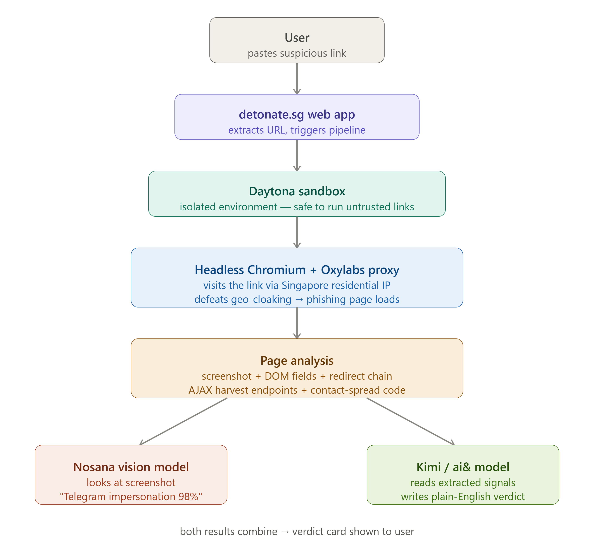

<div align="center">

# 🧨 detonate.sg

### *It doesn't score a link — it detonates it and shows you the trap.*

Forward a suspicious message to a Telegram bot. It opens the link in an isolated browser **from a Singapore home connection**, walks the entire scam funnel, captures the credential theft as it happens, and replies in-chat with **proof** — not a risk score.

[](https://daytona.io)
[](https://oxylabs.io)
[](https://nosana.io)
[](https://aiand.com)
[](https://doubleword.ai)

</div>

---

## 🎯 The problem

On **1 October 2025**, the Singapore Police Force warned of a live campaign: fake **GST Voucher / government payout** messages arriving on Telegram — *from a friend whose account was already hijacked* — leading to a fake Telegram login that **steals your account and auto-spreads the same trap to all your contacts.** A worm, powered by trust.

Government-impersonation scams **more than doubled in 2025** (+123.6%, **S$242.9M** lost).

The catch: these pages **cloak**. They detect scanners (datacenter IPs) and serve a harmless decoy, showing the real trap *only* to a genuine Singapore victim. So ScamShield, urlscan, and VirusTotal often see the bait and report **"looks clean."**

---

## 💡 Why detonate.sg is different

| | ScamShield / urlscan / VirusTotal | 🧨 detonate.sg |
|---|---|---|
| **Vantage** | Datacenter IP → **gets cloaked, sees a decoy** | **SG residential IP** → sees the *real* trap |
| **What it returns** | A yes/no risk score | **Evidence**: the actual pages, the captured credential POST, the worm code |
| **How it decides** | URL/text reputation | **Behavior** — what the page *does*, which a kit can't fake |
| **Surface** | Separate app / website | **In Telegram**, where the scam already lives |

> **Core insight:** a phishing kit copying Telegram's real logo is *pixel-identical* to the real site — no vision model can tell them apart. But it **must** POST your credentials somewhere, **must** ask for an OTP on a webpage (real Telegram never does), and **must** run on a non-Telegram domain. **Behaviour is unfakeable. We detect on behaviour, not pixels.**

---

## 📱 What you get back

Forward the bot a scam message, and ~10 seconds later it replies with:

```
🚩 Telegram impersonation — 100% scam

🎣 Step 1: the bait  ......... [screenshot: fake GST Voucher gov claim]
🚩 Step 2: the trap  ......... [screenshot: fake Telegram login]
💀 Step 3: the result ........ [screenshot: "you got scammed"]

🔍 This page harvests: NRIC · Phone · Login code (OTP) · 2FA password
📄 It literally says: "Enter the code we sent to your phone"
🕵️ Showed a harmless decoy to the scanner, the real trap to a Singapore visitor
🪱 Once in, it messages your whole contact list — that's how it spreads
🧨 Isolated in Daytona sandbox a1b2c3d4

[🚨 Report to ScamShield]  [🔒 Enable Telegram 2FA]
```

Send it a **legitimate** login (e.g. `github.com/login`) and it correctly replies **✅ Looks legitimate** — because the domain belongs to the brand.

---

## ⚙️ How it works

<div align="center">



</div>

1. **Extract** the URL from the forwarded message (text, caption, or hidden hyperlink).
2. **Detonate** — two browser passes in parallel:
   - a **US "scanner" exit** (sees the decoy)
   - a **Singapore residential exit** (Oxylabs) that sees the real trap and **walks the funnel** — screenshots each stage, fills dummy values, clicks through (gov claim → fake login → outcome), and **captures the harvest POST off the wire**.
3. **Analyse** in parallel:
   - **Agent transcript → scam classifier** (the evasion-proof verdict: domain-vs-brand, harvest POST, field combo)
   - **Screenshot → OCR** (the literal incriminating text)
   - **Screenshot → brand vision** (context)
4. **Verdict** — a plain-English explanation of the whole two-stage trap.
5. **Reply** in Telegram with the screenshots + evidence + one-tap ScamShield/2FA actions.

**Safety:** dummy values only, and form-filling runs **only against our own mock kit**. Real links are **observe-only** — never submitted. No real credentials are ever entered.

---

## 🏆 Sponsors — each load-bearing

| Sponsor | Role |
|---|---|
| **🟣 Daytona** | Isolated, throwaway execution of the untrusted link — the reason detonating is safe. *(This hackathon's org is Tier 1, which blocks all sandbox egress org-wide; the fetch runs locally while Daytona still spins a real sandbox per check as proof-of-life. One flag flips it fully in-sandbox on Tier 3/4.)* |
| **🔵 Oxylabs** | Singapore residential proxy defeats the geo-cloak — the whole differentiator — plus a US exit for the scanner-vs-victim contrast. |
| **🟢 Nosana** | GPU host running an OpenAI-compatible vLLM endpoint for **transcript-based scam analysis** (the primary, evasion-proof detection path). Fallback chain lets it swap to ai& in one flag. |
| **🟠 ai&** | OpenAI-compatible inference for the verdict copy, the scam classifier, and the vision fallback. |
| **🟡 Doubleword** | DeepSeek-OCR-2 reads the literal incriminating text off the screenshot. |

Everything **degrades gracefully** — Nosana→ai&, ai&→deterministic template, Daytona→local Playwright — so a single sponsor outage never breaks the demo.

---

## 🚀 Quick start

Runs end-to-end **today with zero sponsor keys** (mock data):

```bash
npm install
cp .env.example .env             # USE_MOCKS=true by default
npx tsx scripts/check.ts         # full pipeline → prints a verdict
```

Run the live bot:

```bash
# add TELEGRAM_BOT_TOKEN from @BotFather to .env, then:
npm run bot                      # long-polling — forward it a message with a link
```

Go live with real sponsors:

```bash
# fill sponsor keys in .env, set USE_MOCKS=false
npm run smoke                    # gate check: Daytona egress, Oxylabs SG, ai&, Nosana, Doubleword
```

The mock phishing kit is the deployed React app in [`frontend/`](frontend/) (geo-cloaked on Vercel); `MOCK_KIT_URL` points the detonation at it.

---

## 🧠 Detection philosophy (the unfakeable signals)

The kit can copy any logo. It **cannot** avoid:

| Signal | Source | Why it can't be faked |
|---|---|---|
| **Domain vs brand** | URL after redirects | Can't host on `telegram.org` |
| **Harvest POST** | captured request payload | Can't steal creds without a POST |
| **Cloak detected** | two-pass screenshot diff | Cloaking *is* the scam signal |
| **`api_id`/`api_hash`** | script parse | Needed for the worm to spread |
| **Field combo** (phone+OTP+2FA) | DOM `$$eval` | Removing fields breaks the harvest |

See [`docs/nosana-finetuning.md`](docs/nosana-finetuning.md) for the full decision record on why behaviour beats pixels — and the **training-corpus pipeline** (`fetch-openphish` → `capture-corpus` → `render-training`) that turns real phishing URLs into behavioural transcripts to fine-tune a text model on Nosana.

---

## 📂 Repo layout

```
bot/index.ts              grammy Telegram bot — progress, screenshots, verdict, CTAs
lib/orchestrator.ts       extract → detonate → analyse → verdict
lib/daytona.ts            2-pass isolated detonation  ┐
detonation/worker.mjs     funnel-walking agent worker ┘ (Playwright)
lib/oxylabs.ts            SG + US residential proxy builder
lib/scam-classifier.ts    behavioural scam verdict (signal #6, the primary path)
lib/nosana.ts             screenshot brand vision (context)
lib/aiand.ts              plain-English verdict + fallbacks
lib/doubleword.ts         OCR evidence
lib/verdict.ts            deterministic zero-AI floor
lib/types.ts              shared contracts — the integration boundary
frontend/                 mock phishing kit (React SPA + geo-cloak middleware), deployed to Vercel
scripts/                  smoke test, e2e check, training-corpus pipeline
docs/                     plan, architecture, Nosana fine-tuning decision record
```

---

<div align="center">

**Built for the Daytona HackSprint.** Detonates only its own mock kit on stage — never live criminal infrastructure, never a real account.

*See the trap before it springs.*

</div>
