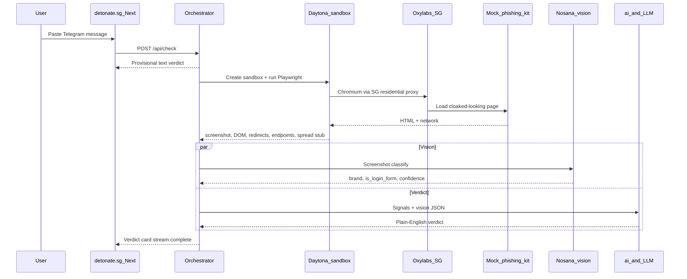
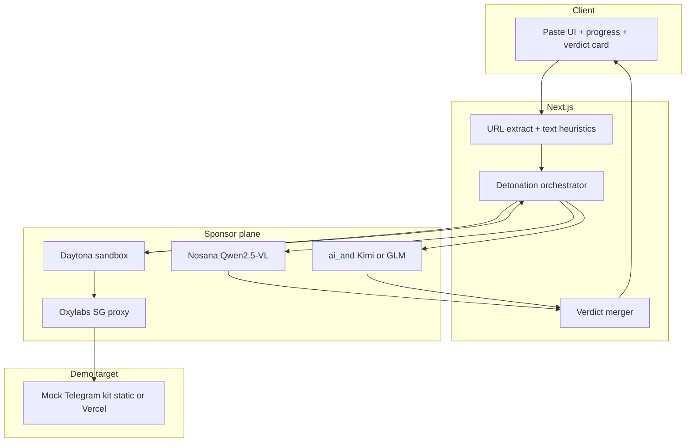

# detonate.sg MVP & Architecture

**Status:** Draft for team discussion — implementation todos not started.

**Defaults locked for this plan:** mock phishing kit as the only demo target (real cloaked URLs = post-MVP); **Next.js App Router** (TypeScript) for UI + orchestration so we ship in one repo with streaming progress.

---

## Product MVP (what ships)

**One job:** User pastes a Telegram lure → app proves the trap with evidence, not a risk score.

| In MVP | Out of MVP |
|--------|------------|
| Paste message (or URL), extract link | Telegram bot / forward-to-bot |
| Instant text provisional verdict | ScamShield API integration beyond a deep-link/CTA |
| Live detonation progress stream (~10–40s) | Multi-user auth, history, accounts |
| Verdict card: SCAM label, screenshot, harvested fields, redirect chain, worm explanation | Live criminal URLs on stage |
| CTAs: “Report to ScamShield (1799)” + “Enable Telegram 2FA” | Credential submission, session takeover |
| Pre-warmed path for the known demo URL | General-purpose phishing detection for all brands |

**Consumer framing:** brand `detonate.sg` + tagline *“See the trap before it springs.”*

**Existing asset to evolve:** `index.html` (on `feature/fake-phishing-site`) is a GST claim decoy with Telegram fields. The report’s visceral demo needs a **Telegram-login clone** (phone → OTP → 2FA) plus AJAX harvest + contact-spread stub. Treat that page as a rough start; rebuild/reshape into a convincing mock kit.

---

## Demo flow (matches `docs/detonate_sg_architecture.png`)



---

## System architecture



### Components

1. **Web UI** — single-page flow: paste → provisional banner → live status steps → verdict card with screenshot. No cards in the marketing hero; the **verdict card is the interaction container** after submit.
2. **Orchestrator** (`/api/check` + SSE or streamed JSON) — owns URL extract, Daytona lifecycle, parallel AI calls, merge.
3. **Detonation worker (inside Daytona)** — Playwright + Chromium image; proxy = Oxylabs SG; outputs a fixed JSON artifact:
   - `screenshotBase64`
   - `finalUrl` / `redirectChain`
   - `fields[]` (name, type, placeholder)
   - `ajaxEndpoints[]`
   - `spreadSignals[]` (strings matching contact-list / `api_id` / `api_hash` stubs)
4. **Mock kit** — hosted URL the sandbox always hits for the demo; mirrors real kit UX without touching criminal infra.
5. **Nosana vision** — `{ brand, is_login_form, confidence }` from screenshot.
6. **ai& LLM** — consumer copy from signals + vision JSON; hardcoded template fallback if venue Wi‑Fi flakes.

### Repo shape (proposed)

```
app/                 # Next.js App Router UI + API
lib/
  extract.ts         # message → URL + text heuristics
  daytona.ts         # sandbox create/run/teardown
  oxylabs.ts         # proxy config helper
  nosana.ts          # vision call
  aiand.ts           # OpenAI-compatible chat
  verdict.ts         # merge + fallback templates
mock-kit/            # Telegram-clone phishing page (replace/evolve index.html)
docs/                # research + architecture (existing)
```

---

## MVP slice order (demo-critical path)

Build in this order so the 2-minute pitch still works if time runs out:

1. **Mock kit live** — Telegram login UI + AJAX POST stub + visible “propagate to contacts” JS stub; clear DEMO-ONLY banner.
2. **Daytona + Playwright egress** — first-30-min checklist: tier allows outbound; proxy returns SG IP; bake Chromium into snapshot.
3. **Extraction JSON** — screenshot + fields + redirects + endpoints (enough for a manual verdict without AI).
4. **UI shell** — paste → progress → show screenshot + field list (visceral moment).
5. **ai& verdict copy** — plain English on the card.
6. **Nosana vision badge** — “Telegram impersonation 98%” for the pitch climax.
7. **Polish** — provisional text verdict, ScamShield/2FA CTAs, demo-URL cache/pre-warm.

**Sponsor narrative (each load-bearing):** Daytona = safe untrusted execution; Oxylabs = beat geo-cloak; Nosana = brand from pixels; ai& = human explanation.

---

## Proposed implementation todos (not started — pending team discussion)

1. Rebuild mock Telegram phishing kit (phone→OTP→2FA, AJAX harvest, contact-spread stub)
2. Wire Daytona sandbox + Playwright Chromium + Oxylabs SG proxy; confirm egress
3. Define and emit detonation JSON (screenshot, fields, redirects, endpoints, spread signals)
4. Next.js paste UI + streaming `/api/check` orchestrator + verdict card
5. Integrate ai& LLM verdict + Nosana vision; add template/cache fallbacks
6. Provisional text verdict, ScamShield/2FA CTAs, pre-warm demo URL path

---

## Top risks (from research — verify before coding deep)

- **Daytona egress tier** — Tier 1/2 may block outbound. Fallback: Playwright on a permitted host; Daytona still runs isolated parsing of untrusted DOM/JS so the sponsor story holds.
- **Oxylabs auth / SG exit** — smoke-test `ip.oxylabs.io` before full flow.
- **ai& / Nosana latency** — pre-warm + cache results for the known demo URL; keep template fallback.
- **Mock fidelity** — current fake phishing page is a gov claim form; rebuild toward fake Telegram Web login for the screenshot to read as impersonation.

---

## Success criteria for “MVP done”

- Paste the canned GST Telegram message → provisional “suspicious” within ~1s.
- Detonation completes against **our** mock kit via Daytona + SG proxy.
- Verdict card shows screenshot + harvested fields (phone/OTP/2FA) + worm one-liner.
- Vision confidence + LLM explanation both visible (or LLM + cached vision if Nosana is late).
- No credentials ever submitted; demo framed as controlled replica.
